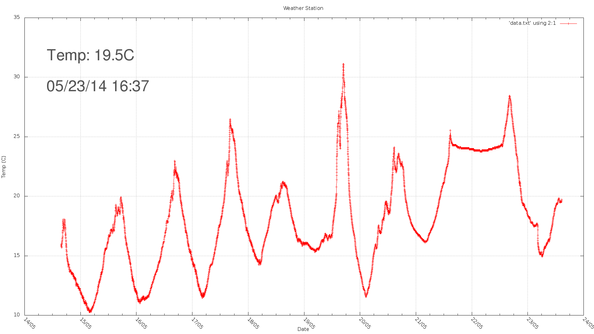

WeatherStation
==============

The mcu (atmega328p) measures the thermistor and it's internal voltage and sends the data with the nRF24L01 to one connected to a raspberry pi. Then it goes to sleep for 54sec. The raspberry pi stores the data in a file and runs a python script. The python script plots the data using gnuplot, and adds text to the image containing the newst measurment. The finished image is shared with http.

Using the RF24 library: http://maniacbug.github.io/RF24/index.html
